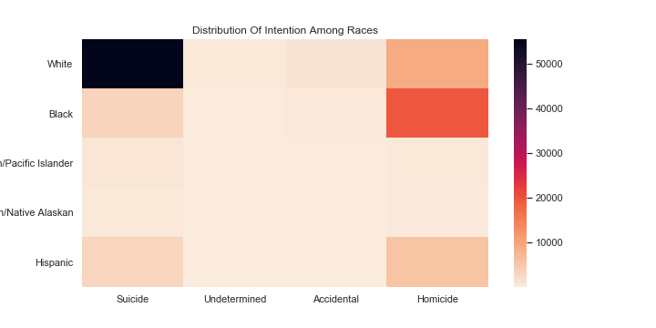
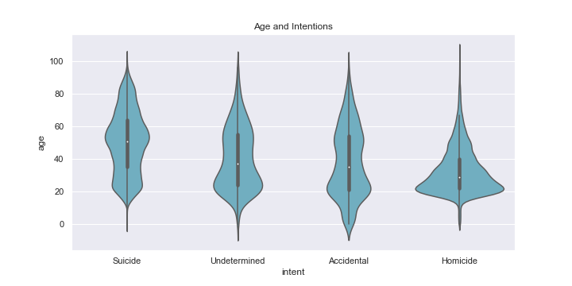

# Comunicating Data Findings
## by Mostafa Ahmed

## Gun Deaths Im America Dataset

> This Dataset is about differant death causes in america,\
like Suicide, Homiecide, and Accedents, at the period of 2012 to 2014,\
it provides differant informations about the situation such like,\
police intervention, age, race, education, date, gender.

## Summary of Findings

> We found a lot of inttersting things,\
- The most intentions in our dataset are suicide, homiecide, accedents, respectively.
- Men suicide more than women,\
howver wome attempts are more often,\
moreover they are more prone to depresion,\
but males suicide methods are more violent, making them more likely to complete before anyone can intervent.
- The spring is the most period that we can see number of sucide attempts increase.
- February has the least number of over all deaths.
- In America White race is the most sucide, and Black race is the most homicide.
- Most race shooted by police is the White race.
- all intentions have biomodal distribution of age, except homicide peak at arround 19 then falls.
- In both Homicide and suicide, white race density is arround 55, while other races density is arround 20 then it takes falling

## Some Plots From The Presentation

## Files:
- readme.md - This Markdown file contains an interview about the repository.
- exploration_template.ipynb - This Jupyter Notebook contains code used to wrangle and exporee data.
- slide_deck_template.ipynb - This Jupyter Notebook contains the codee to build the presntation.
- output_toggle.tpl - This template file can be used with nbconvert to export your slide deck. This adds extra functionality to the slide deck by hiding the code to start, only making it visible if the reader clicks on the output (which should mostly be visualizations in the case of this project).
- Death Data.csv , The original data file, death_data_cleaned.csv the wrangled file.
